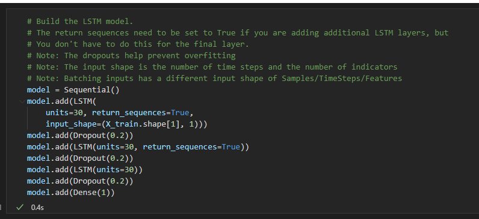
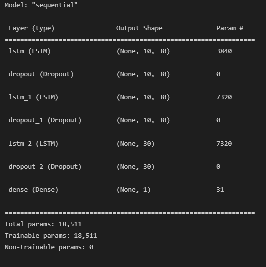
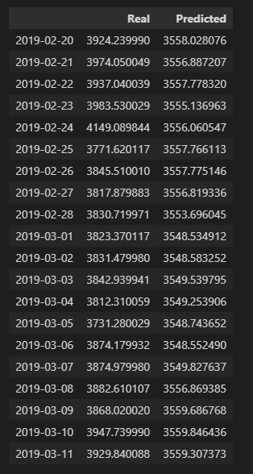
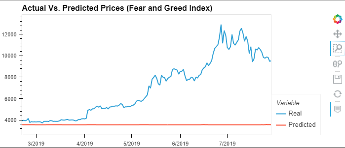
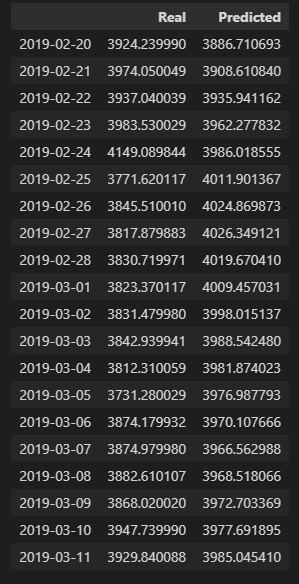
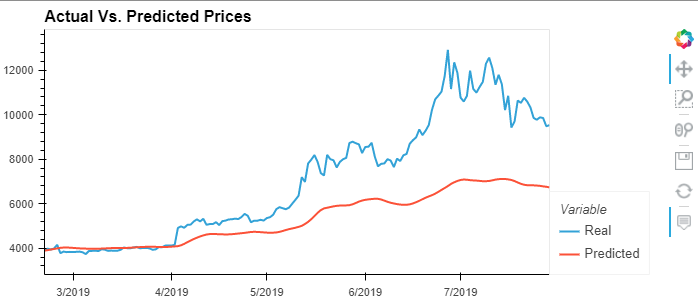

# LSTM Stock Predictor

Due to the volatility of cryptocurrency speculation, investors will often try to incorporate sentiment from social media and news articles to help guide their trading strategies. One such indicator is the [Crypto Fear and Greed Index (FNG)](https://alternative.me/crypto/fear-and-greed-index/) which attempts to use a variety of data sources to produce a daily FNG value for cryptocurrency. You have been asked to help build and evaluate deep learning models using both the FNG values and simple closing prices to determine if the FNG indicator provides a better signal for cryptocurrencies than the normal closing price data.

In this assignment, I will use deep learning recurrent neural networks to model bitcoin closing prices. One model will use the FNG indicators to predict the closing price while the second model will use a window of closing prices to predict the nth closing price.

I will need to:

1. [Prepare the data for training and testing](#prepare-the-data-for-training-and-testing)
2. [Build and train custom LSTM RNNs](#build-and-train-custom-lstm-rnns)
3. [Evaluate the performance of each model](#evaluate-the-performance-of-each-model)

- - -
## Build the Model

---
## Summarize the Model

---
## Fear and Greed Real vs Predicted Prices

---
## Fear and Greed Index Plot

---
## Bitcoin Closing Prices Real vs Predicted Prices

---
## Bitcoin Closing Prices Model Plot

---

 Which model has a lower loss? 
 
 - Bitcoin closing prices 

 

 Which model tracks the actual values better over time? 
 
 - Bitcoin closing prices  

 

 Which window size works best for the model? 
 
 - A window size of 2  

 
